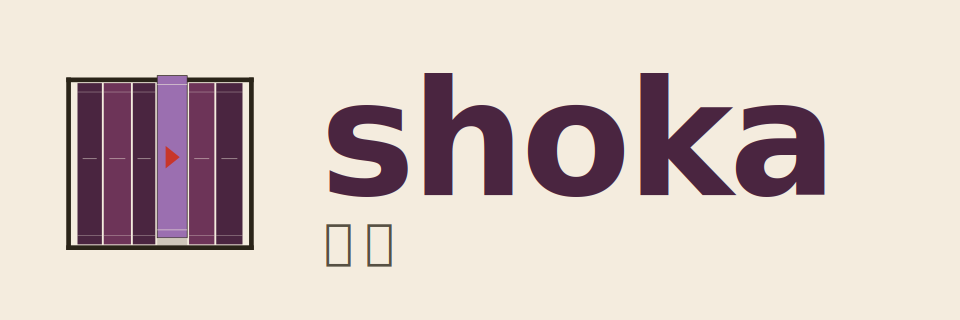

<p align="center">
  <picture>
    <source media="(prefers-color-scheme: dark)" srcset="assets/logo-dark.svg" />
    
  </picture>
</p>

<p align="center"><em>your repository bookshelf.</em></p>

<p align="center">
  <a href="https://crates.io/crates/shoka"></a>
  <a href="https://github.com/yukimemi/shoka/actions/workflows/ci.yml"></a>
  <a href="./LICENSE"></a>
</p>

**shoka** (書架, _"bookshelf"_) is a repository workspace manager
written in Rust — a modern, jj-aware successor to
[`ghq`](https://github.com/x-motemen/ghq) and
[`rhq`](https://github.com/ubnt-intrepid/rhq). It clones repos into
a flat `<root>/<host>/<owner>/<name>` layout, lets you fuzzy-`cd`
between them, runs commands in parallel across the whole shelf, and
(coming next) surfaces every repo's working state at a glance via a
TUI dashboard.

> **Status:** Phase 1 (CLI MVP) is shippable: `clone`, `import`,
> `list`, `cd`, `exec`, `prune`, `cache`. Phase 2 (the TUI
> dashboard) is the next milestone.

## Why another one

`ghq` and `rhq` nailed "where do I clone things" — but they're
git-only and stop at `list` / `look`. shoka picks up from there:

- **jj as a first-class VCS** alongside git — `shoka clone` /
  `exec` work for both, no `ghq-jj` shim needed.
- **TUI dashboard** (Phase 2) for the whole shelf at a glance.
- **Profiles** to keep `work` / `personal` / `oss` separated.
- **Routes** for per-org clone destinations + per-route VCS / protocol.
- **`AGENTS.md` aware** for AI-heavy workflows (`shoka list --has-agents`).
- **ghq layout compatible** — drop-in for existing `~/ghq/...`
  trees via `shoka import`.
- **In-process git via `gix`** — no `git` subprocess fan-out, so
  `import` over a large shelf stays fast even on Windows where
  `CreateProcess` dominates the cost.

## Install

```sh
cargo install shoka
```

Pre-built binaries for Linux / macOS / Windows are attached to each
[GitHub release](https://github.com/yukimemi/shoka/releases).

## Quick start

```sh
# 1. (optional) adopt an existing ghq tree
shoka import ~/ghq

# 2. or clone fresh
shoka clone yukimemi/shoka          # → <root>/github.com/yukimemi/shoka

# 3. see what's on the shelf
shoka list

# 4. jump into one (with the shell wrapper installed — see below)
s shoka

# 5. run something across everything (or a tag-filtered subset)
shoka exec --tag rust -- cargo check
```

## Commands

| Command | What it does |
| :--- | :--- |
| `shoka clone <spec>` | Clone a repo via `gix` (or `jj git clone` when `vcs = jj`). Accepts full URLs, `owner/name`, or `host/owner/name`. |
| `shoka import <dir>` | Walk a directory, find existing `.git/` repos, and adopt them onto the shelf. |
| `shoka list` | Print the shelf with optional `--tag` / `--has-agents` filters. |
| `shoka cd [hint]` | Resolve a repo to its on-disk path (use the shell wrapper to actually `cd`). |
| `shoka exec -- <cmd>` | Run `<cmd>` in each matching repo in parallel; output is captured + banner-headed per repo. |
| `shoka prune` | Drop shelf entries whose clone path is missing on disk. `--dry-run` to rehearse; `--yes` to skip the prompt. |
| `shoka cache {refresh,show,clear}` | Per-repo volatile cache. Auto-refreshed in the background after most commands. |
| `shoka doctor` | Diagnose environment + config. |
| `shoka init-shell <shell>` | Print the shell wrapper for `cd` (see below). |
| `shoka completion <shell>` | Print a shell-completion script. |
| `shoka tui` | TUI dashboard. **Phase 2** — not yet implemented. |

`shoka exec` is the transparent escape hatch: shoka never
interprets the command. `shoka exec -- git fetch`, `shoka exec --
jj git fetch`, `shoka exec -- cargo check` all work the same way.
Output from each repo is captured and printed as a banner-headed
block when the process exits, so parallel runs don't interleave
into nonsense.

## Shell integration for `cd`

A child process can't change its parent shell's cwd, so `shoka cd`
prints the chosen path and a small wrapper function does the
actual `cd`. The wrapper uses a `SHOKA_CD_OUT` sidechannel file so
the interactive fuzzy picker can render normally while the path
travels out-of-band.

### PowerShell

```pwsh
# one-shot (current session):
shoka init-shell powershell --name s | Out-String | Invoke-Expression

# persistent (append to $PROFILE):
shoka init-shell powershell --name s | Add-Content $PROFILE
. $PROFILE
```

### bash / zsh

```sh
# add to ~/.bashrc or ~/.zshrc:
eval "$(shoka init-shell bash --name s)"   # or zsh
```

### fish

```fish
# ~/.config/fish/config.fish:
shoka init-shell fish --name s | source
```

After that, `s shoka` cds straight into the repo, `s` with no
arg opens a fuzzy picker, `s --tag rust` filters before the picker.

## Configuration

`config.toml` lives at the OS-standard config dir (Linux
`$XDG_CONFIG_HOME/shoka/`, macOS
`~/Library/Application Support/yukimemi.shoka/`, Windows
`%APPDATA%\yukimemi\shoka\config\`). A starter is auto-written on
first run.

Minimal example:

```toml
[global]
root = "~/src"
default_host = "github.com"
default_protocol = "https"
default_vcs = "auto"

[[routes]]
pattern = "host:github.com/mycompany"
root = "~/src/work"
default_protocol = "ssh"

[profiles.work]
default_host = "github.mycompany.com"

[global.cache]
background_refresh = true
refresh_threshold_secs = 60
```

Route patterns support `host:<host>`, `host:<host>/<owner>`, and
`/<regex>/`. The first matching route wins. Profile beats routes
when `profile.root` is set; otherwise routes evaluate against the
raw `[global]` baseline.

Files in the same dir matching `config.*.toml` are layered on top
(alphabetical order; `config.local.toml` last wins). All values
flow through [`teravars`](https://github.com/yukimemi/teravars) so
`[vars]` self-references resolve before deserialization.

## Roadmap

- **Phase 1 — CLI MVP** ✅ `clone` / `import` / `list` / `cd` /
  `exec` / `prune` / `cache`, shell integration, completion. Done.
- **Phase 2 — TUI dashboard.** `ratatui` + `crossterm` + `nucleo`
  fuzzy. Per-repo cached status (branch / ahead-behind / dirty),
  `gh` integration for open PRs / CI / contribution graph.
- **Phase 3 — Polish.** Per-profile route overrides, scaffolding
  via `shoka new`, bulk org-move follow, OSC 7 cwd hint.

## Development

```sh
cargo make check        # fmt + clippy + locked check + tests
cargo make pre-release  # the whole check suite, exactly as CI runs it
```

PRs go through [Gemini Code Assist](https://gemini.google.com/) +
[CodeRabbit](https://coderabbit.ai/) reviewers on top of standard
CI. The yukimemi/* convention is:
[`renri`](https://github.com/yukimemi/renri) worktrees + `kata
apply` for the shared template, see [AGENTS.md](./AGENTS.md) for
the details.

## License

MIT — see [LICENSE](./LICENSE).
